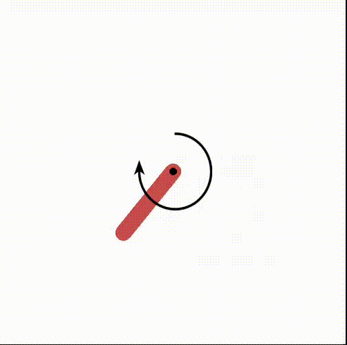

# Learning-Based Control with Deep Reinforcement Learning

> A comprehensive implementation of Deep Q-Networks (DQN) for learning-based control on classic reinforcement learning environments, featuring curriculum learning, custom reward shaping, and balance task implementations.

[](https://www.python.org/downloads/)
[](https://pytorch.org/)
[](https://gymnasium.farama.org/)
[](https://opensource.org/licenses/MIT)
[](https://github.com/psf/black)

## Demo

<div align="center">
  
  <p><em>DQN agent balancing inverted pendulum within ±1.1° (0.02 rad) for 2 seconds</em></p>
</div>

## Overview

This project explores the application of Deep Q-Networks to control tasks, with a focus on:
- **Action discretization** for continuous control spaces
- **Curriculum learning** for hard tasks with sparse rewards
- **Custom environment wrappers** for balance tasks
- **Precision control** with discrete actions

The repository contains implementations for CartPole, MountainCar, Acrobot, and Pendulum environments, with custom balance tasks that require sustained stabilization.

## Key Features

- **DQN Agent**: Full implementation with experience replay, target networks, and epsilon-greedy exploration
- **Action Discretization**: Convert continuous action spaces to discrete bins for DQN compatibility
- **Balance Wrappers**: Custom Gymnasium wrappers for inverted pendulum balance tasks
- **Curriculum Learning**: Progressive difficulty scheduling for challenging tasks
- **Reward Shaping**: Precision-based rewards encouraging accuracy
- **Comprehensive Evaluation**: Success rate tracking and performance metrics

## Installation

### Prerequisites
- Python 3.8+
- Virtual environment (recommended)

### Setup

```bash
# Clone the repository
cd learning-based-control

# Create and activate virtual environment
python -m venv .venv
source .venv/bin/activate  # On Windows: .venv\Scripts\activate

# Install dependencies
pip install -r requirements.txt
```

## Quick Start

### Training a Model

```bash
cd dqn

# Train standard Pendulum swing-up
python train.py pendulum

# Train Pendulum balance task with curriculum learning
python train.py pendulum_balance

# Train CartPole
python train.py cartpole

# Train Acrobot swing-up
python train.py acrobot
```

### Evaluating a Model

```bash
# Evaluate with visualization
python eval.py pendulum_balance

# Evaluate without rendering (faster)
python eval.py pendulum_balance --no-render
```

## Project Structure

```
learning-based-control/
├── dqn/
│   ├── agent.py                    # DQN agent implementation
│   ├── train.py                    # Training script with curriculum support
│   ├── eval.py                     # Evaluation script
│   ├── configs/                    # Environment configurations
│   │   ├── acrobot.py             # Acrobot swing-up config
│   │   ├── cartpole.py            # CartPole config
│   │   ├── pendulum.py            # Pendulum swing-up config
│   │   └── pendulum_balance.py    # Pendulum balance with curriculum
│   ├── wrappers/                   # Custom Gymnasium wrappers
│   │   ├── action_discretizer.py  # Continuous → discrete actions
│   │   ├── acrobot_balance.py     # Acrobot balance wrapper
│   │   └── pendulum_balance.py    # Pendulum balance wrapper
│   ├── models/                     # Saved model weights (.pth)
│   └── plots/                      # Training progression plots
├── q_learning/                     # Q-learning implementations
└── docs/                           # Documentation and blog
```

## Results Summary

### Pendulum Balance Task Progression

| Threshold | Duration | Curriculum | Action Bins | Episodes | Success Rate | Avg Reward | Variance |
|-----------|----------|------------|-------------|----------|--------------|------------|----------|
| 0.1 rad (±5.7°) | 1.0s | ❌ No | 21 | 368 | 100% | 633.19 | ±45.50 |
| 0.1 rad (±5.7°) | 2.0s | ❌ No | 21 | 226 | 100% | 1260.16 | ±94.85 |
| **0.05 rad (±2.9°)** | **2.0s** | **❌ No** | **21** | **~600** | **50%** | **978.37** | **±1472.89** |
| **0.05 rad (±2.9°)** | **2.0s** | **✅ Yes** | **21** | **~600** | **100%** | **3057.32** | **±455.83** |
| **0.03 rad (±1.7°)** | **2.0s** | **✅ Yes** | **21** | **465** | **100%** | **3081.61** | **±57.72** |
| 0.02 rad (±1.1°) | 2.0s | ✅ Partial¹ | 21 | 465 | 100%² | 2690.77 | ±922.42 |
| **0.02 rad (±1.1°)** | **2.0s** | **✅ Full³** | **21** | **2000** | **100%** | **2536.43** | **±85.19** |

<sup>1</sup> Partial: Trained with curriculum up to 0.06 rad, evaluated at 0.02 rad (generalization test) </br>
<sup>2</sup> High variance indicates unstable performance at generalization limit </br>
<sup>3</sup> Full: Complete curriculum training from 0.10 rad down to 0.02 rad - stable, deployment-ready performance

### Other Environments

| Environment | Task | Episodes to Solve | Success Rate |
|-------------|------|-------------------|--------------|
| CartPole-v1 | Standard | ~150 | 100% |
| Pendulum-v1 | Swing-up | 731 | 60% |
| Acrobot-v1 | Swing-up | ~500 | High |
| Acrobot-v1 | Balance (0.1 rad) | - | Failed (plateaued at -280) |

## Key Findings

### 1. Curriculum Learning is Essential for Sparse Rewards

**Without curriculum (0.05 rad balance):**
- 50% success rate
- Extremely high variance (±1472.89)
- Agent struggled to discover balancing policy

**With curriculum (0.05 rad balance):**
- 100% success rate
- Much lower variance (±455.83)
- Smooth learning progression

**Curriculum schedule used (for 0.02 rad final target):**
```python
(0,    0.10),  # Episodes 0-199: Easy (±5.7°)
(200,  0.08),  # Episodes 200-399: Medium (±4.6°)
(400,  0.06),  # Episodes 400-599: Harder (±3.4°)
(600,  0.05),  # Episodes 600-799: Hard (±2.9°)
(800,  0.04),  # Episodes 800-999: Very Hard (±2.3°)
(1000, 0.03),  # Episodes 1000-1199: Extremely Hard (±1.7°)
(1200, 0.02),  # Episodes 1200+: Target (±1.1°)
```

### 2. DQN Loss Behavior in RL

Unlike supervised learning, **increasing loss can indicate successful learning** in DQN:
- Early training: Low rewards → small Q-values → low variance → low TD error
- Later training: High rewards → large Q-values → high variance → high TD error
- **Focus on reward trends, not loss minimization**

### 3. Generalization from Curriculum Learning

Training with curriculum up to 0.06 rad (±3.4°) produced a policy that generalized to:
- ✅ **0.03 rad (±1.7°)**: Perfect performance (100% success, ±57.72 variance)
- ⚠️ **0.02 rad (±1.1°)**: Unstable performance (100% success, ±922.42 variance)

The curriculum built robust fundamentals that transfer beyond training conditions.

### 4. Action Discretization Requirements

**21 discrete action bins** (0.2 torque steps) were sufficient for:
- Pendulum swing-up
- Balance tasks down to 0.03 rad (±1.7°)

**Limitations observed at 0.02 rad (±1.1°):**
- High performance variance suggests finer control needed
- 31+ bins likely required for reliable sub-2° precision

### 5. Underactuated vs. Fully Actuated Systems

| System | Links | Actuation | Balance Task (0.1 rad) | Result |
|--------|-------|-----------|------------------------|--------|
| Pendulum | 1 | Fully actuated | 2 seconds | ✅ Solved (100%) |
| Acrobot | 2 | Underactuated | 1 second | ❌ Failed (plateaued) |

**Conclusion:** DQN with discrete actions struggles with underactuated double-link systems. Acrobot balancing likely requires:
- Continuous action methods (DDPG, TD3, SAC)
- Model-based control (LQR, MPC)
- Finer action discretization (>50 bins)

### 6. Reward Shaping for Precision

**Precision bonus implementation:**
```python
if is_balanced:
    precision = 1.0 - (theta_dev / angle_threshold)
    reward = 10.0 + precision * 20.0  # Range: [10, 30]
```

This creates a gradient within the balanced region, encouraging the agent to maintain perfect vertical position rather than just staying within bounds.

**Impact:**
- Without precision bonus: Agent stays anywhere in threshold
- With precision bonus: Agent aims for perfect vertical (θ ≈ 0°)

## Configuration

Configurations are modular and located in `dqn/configs/`. Key parameters:

```python
CONFIG = {
    # Environment
    'env_name': 'Pendulum-v1',
    'use_action_discretizer': True,
    'n_action_bins': 21,

    # Balance task
    'use_balance_wrapper': True,
    'balance_duration': 2.0,        # Seconds to maintain balance
    'angle_threshold': 0.02,        # Maximum angle deviation (radians)

    # Curriculum learning
    'use_curriculum': True,
    'curriculum_schedule': [
        (0,    0.10),   # Episodes 0-199: Easy (±5.7°)
        (200,  0.08),   # Episodes 200-399: Medium (±4.6°)
        (400,  0.06),   # Episodes 400-599: Harder (±3.4°)
        (600,  0.05),   # Episodes 600-799: Hard (±2.9°)
        (800,  0.04),   # Episodes 800-999: Very Hard (±2.3°)
        (1000, 0.03),   # Episodes 1000-1199: Extremely Hard (±1.7°)
        (1200, 0.02),   # Episodes 1200+: Target (±1.1°)
    ],

    # DQN hyperparameters
    'hidden_dim': 256,
    'learning_rate': 5e-4,
    'gamma': 0.99,
    'buffer_size': 100000,
    'batch_size': 128,
    'target_update_freq': 200,

    # Training
    'episodes': 2000,
    'epsilon_decay': 0.998,

    # Early stopping (disabled to complete full curriculum)
    'early_stop': False,
}
```

## Requirements

See [`requirements.txt`](requirements.txt) for the complete list of dependencies.

**Core dependencies:**
```
torch>=2.0.0
numpy>=1.24.0
gymnasium>=0.29.0
matplotlib>=3.7.0
tqdm>=4.65.0
```

Install all dependencies:
```bash
pip install -r requirements.txt
```

## Documentation

For detailed insights into the development process and technical deep dives:
- [Development Blog](https://kalaiselvan-t.github.io/) - Complete journey from initial experiments to final results
<!-- - [Curriculum Learning Guide](docs/curriculum_learning.md) - Deep dive into curriculum learning implementation -->

## Future Work

### Solving Acrobot Balance

The double-link underactuated Acrobot remains unsolved for the balance task with discrete actions. Future approaches:

- [ ] **Continuous action methods**: Implement DDPG, TD3, or SAC for fine-grained torque control
- [ ] **Finer discretization**: Try 50-100 action bins to test if precision is the bottleneck
- [ ] **Hybrid control**: RL-based swing-up followed by LQR stabilization at upright position
- [ ] **Curriculum for Acrobot**: Apply successful curriculum strategy from Pendulum
- [ ] **Model-based methods**: Compare with MPC or iLQR for baseline performance

### Algorithmic Improvements

Enhance the DQN agent with state-of-the-art techniques:

- [ ] **Prioritized Experience Replay**: Learn more from important transitions
- [ ] **Dueling DQN**: Separate value and advantage function estimation
- [ ] **Rainbow DQN**: Combine multiple improvements (dueling, PER, noisy nets, distributional RL)
- [ ] **Automatic curriculum learning**: Adaptive difficulty adjustment based on performance metrics
- [ ] **Hindsight Experience Replay**: Learn from failed attempts
- [ ] **Double DQN**: Reduce overestimation bias in Q-values

### New Environments and Challenges

Expand to more complex control tasks:

- [ ] **Double inverted pendulum**: Balance two links both inverted (4D state space)
- [ ] **3D inverted pendulum**: Spherical balancing task with 6D state
- [ ] **CartPole balance**: Tighter angle constraints than standard CartPole-v1
- [ ] **Furuta pendulum**: Rotary inverted pendulum (different dynamics)
- [ ] **Acrobot swing-up variations**: Different link lengths, masses, or friction
- [ ] **Real robot deployment**: Sim-to-real transfer on physical hardware
- [ ] **Humanoid balancing**: Apply curriculum learning to bipedal balance

### Deep Analysis and Visualization

Understanding what the agent learned:

- [ ] **Curriculum ablation studies**: Which stages are critical? Can we skip any?
- [ ] **Q-value visualization**: Heatmaps of learned value function over state space
- [ ] **Policy evolution**: Visualize how policy changes through curriculum stages
- [ ] **Failure mode analysis**: Systematic study of when/why the agent fails
- [ ] **Generalization boundaries**: Mathematical characterization of transfer limits
- [ ] **Sensitivity analysis**: Robustness to hyperparameter changes
- [ ] **Comparison with baselines**: Quantitative comparison with LQR, MPC, iLQR
- [ ] **Curriculum schedule optimization**: Automated search for optimal stage transitions

### Practical Extensions

Making the agent more robust and deployable:

- [ ] **Energy-efficient control**: Multi-objective optimization (balance + minimize torque)
- [ ] **Robust control under disturbances**: Handle wind gusts, sensor noise, model mismatch
- [ ] **Safe RL with constraints**: Hard limits on torque, angle, velocity
- [ ] **Multi-task learning**: Single network trained on multiple threshold tasks simultaneously
- [ ] **Domain randomization**: Train on varied physics parameters for robustness
- [ ] **Real-time deployment**: Optimize inference speed for control loops
- [ ] **Fault tolerance**: Graceful degradation under actuator failures
- [ ] **Human-in-the-loop**: Interactive curriculum adjustment during training

## Acknowledgments

- OpenAI Gym/Gymnasium for providing excellent RL environments
- PyTorch team for the deep learning framework
- The RL community for research and insights on curriculum learning

## License

MIT License - see LICENSE file for details

---

**Key Achievement:** Successfully trained a DQN agent to balance an inverted pendulum within **±1.1° (0.02 rad) for 2 seconds** using only 21 discrete actions, achieved through curriculum learning and precision reward shaping. The agent demonstrates stable, deployment-ready performance with 100% success rate and remarkably low variance (±85.19).
